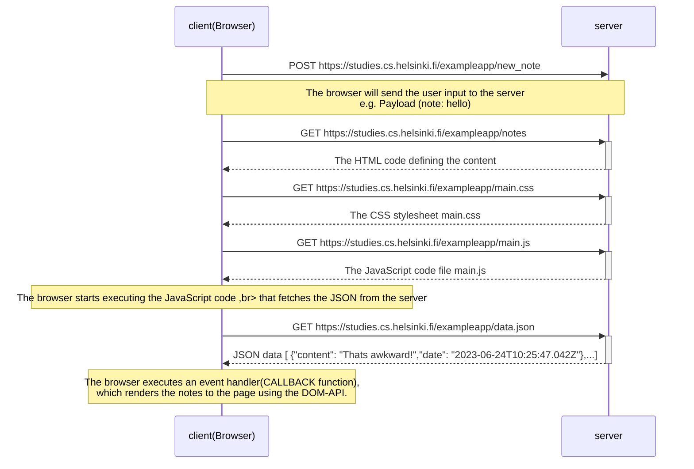

```mermaid

    sequenceDiagram
    participant client(Browser)
    participant server

    client(Browser)->>server : POST https://studies.cs.helsinki.fi/exampleapp/new_note

    Note over client(Browser),server: The browser will send the user input to the server <br>e.g. Payload (note: hello)

    %% + means activate
    client(Browser)->>+server : GET https://studies.cs.helsinki.fi/exampleapp/notes 

    %% - means deactivate
    server-->>-client(Browser) : The HTML code defining the content

    client(Browser)->>+server : GET https://studies.cs.helsinki.fi/exampleapp/main.css

    server-->>-client(Browser) : The CSS stylesheet main.css

    client(Browser)->>+server : GET https://studies.cs.helsinki.fi/exampleapp/main.js

    server-->>-client(Browser) : The JavaScript code file main.js

    Note over client(Browser): The browser starts executing the JavaScript code ,br> that fetches the JSON from the server

    client(Browser)->>+server : GET https://studies.cs.helsinki.fi/exampleapp/data.json

    server-->>-client(Browser) : JSON data [ {"content": "Thats awkward!","date": "2023-06-24T10:25:47.042Z"},...]

    Note over client(Browser): The browser executes an event handler(CALLBACK function), <br>which renders the notes to the page using the DOM-API.


```