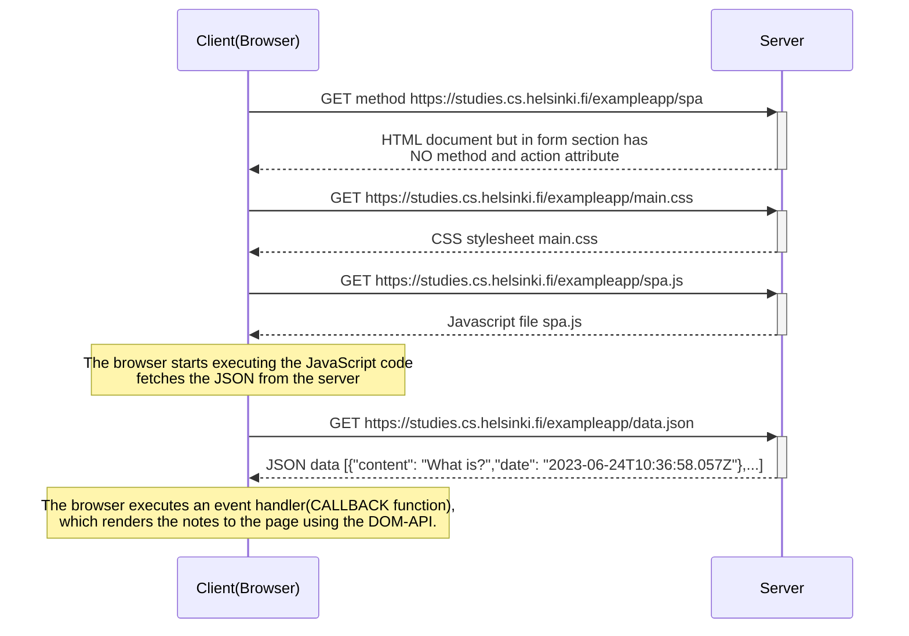

```mermaid

    sequenceDiagram
    participant Client(Browser)
    participant Server

    Client(Browser)->>+Server: GET method https://studies.cs.helsinki.fi/exampleapp/spa
    Server-->>-Client(Browser): HTML document but in form section has <br> NO method and action attribute

    Client(Browser)->>+Server: GET https://studies.cs.helsinki.fi/exampleapp/main.css
    Server-->>-Client(Browser): CSS stylesheet main.css

    Client(Browser)->>+Server: GET https://studies.cs.helsinki.fi/exampleapp/spa.js
    Server-->>-Client(Browser): Javascript file spa.js 

    Note  over Client(Browser): The browser starts executing the JavaScript code <br> fetches the JSON from the server

    Client(Browser)->>+Server: GET https://studies.cs.helsinki.fi/exampleapp/data.json
    Server-->>-Client(Browser): JSON data [{"content": "What is?","date": "2023-06-24T10:36:58.057Z"},...]

    Note over Client(Browser): The browser executes an event handler(CALLBACK function), <br>which renders the notes to the page using the DOM-API.


```