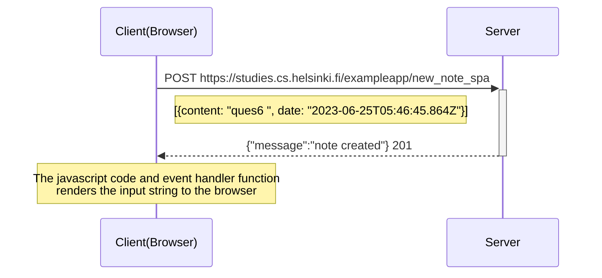

```mermaid

    sequenceDiagram
    participant Client(Browser)
    participant Server

    Client(Browser)->>+Server: POST https://studies.cs.helsinki.fi/exampleapp/new_note_spa

    Note right of Client(Browser) : [{content: "ques6 ", date: "2023-06-25T05:46:45.864Z"}]
    Server-->>-Client(Browser): {"message":"note created"} 201

     Note over Client(Browser) : The javascript code and event handler function <br>renders the input string to the browser


```